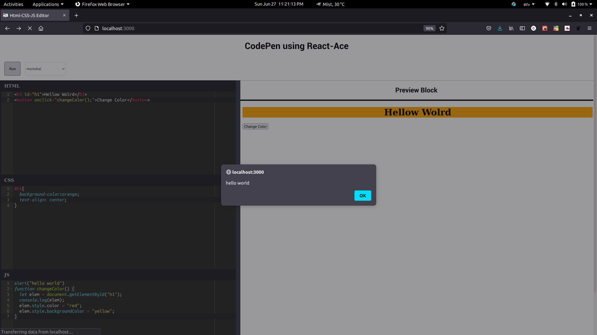
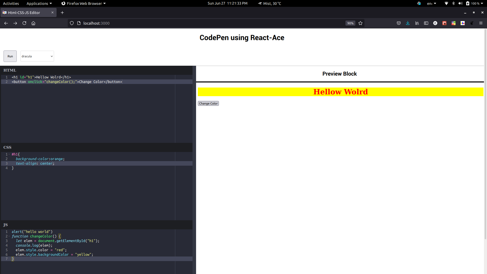

# HTML-CSS-JS Editor  
  - To Run this Application, First install the required depenedencies by running `npm install` command in the terminal
  - Then run `npm start` to start the application. It will start the app in a new tab on `http:localhost:3000/`
  - I have implemented support for different themes in the code editor
---
# Sample Images 
  
  

  
  

  
  

  - hosted at https://wonderful-raman-9d74e6.netlify.app/